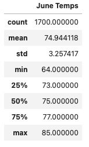
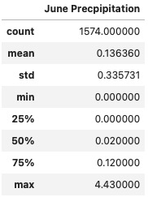
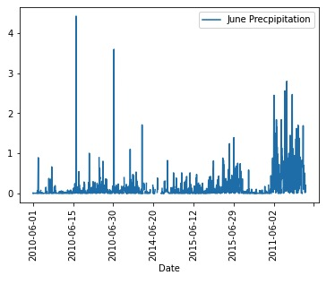
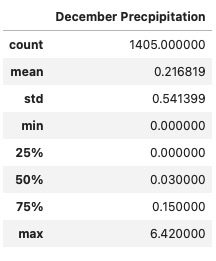
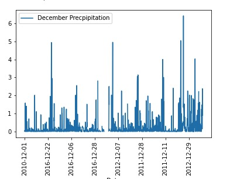

# surfs_up
Using Python, SQLAlchemy, and Flask

## Overview of the Anlaysis
### This project is designed to help W.Avy know more about the weather information in Oahu, Hawaii, before committing to build a Surf and Ice Cream shop to determine if those two business is sustainable year-around.

## Results
    
    

### - The average temperatures are 74.94 in June and 71.04 in December, and the standard deviations are 3.25 and 3.74.

### - Both June and December showed similar min/max, 25th place, 50th place and 75th place.

### - The temperature throughout the year is relatively stable and at a comfortable temperature.

## Summary

### All in all, the temperature does not have dramatic fluctuations throughtout the year, therefore, W. Avy could start those two businesses in Oahu, Hawaii. 

### Two Additional queries
#### The summary for precipitation in June and December as below
    
    
    
        
#### From the statistical data of the two tables, the standard deviation are only 0.33 and 0.55, indicating that there is no obvious outlier in the precipitation of the two months as a whole. From the chart, we know that the precipition in December are more frequent than in June, which means that the business of surf shops in December may be affected, but the ice cream shops will not be affected.